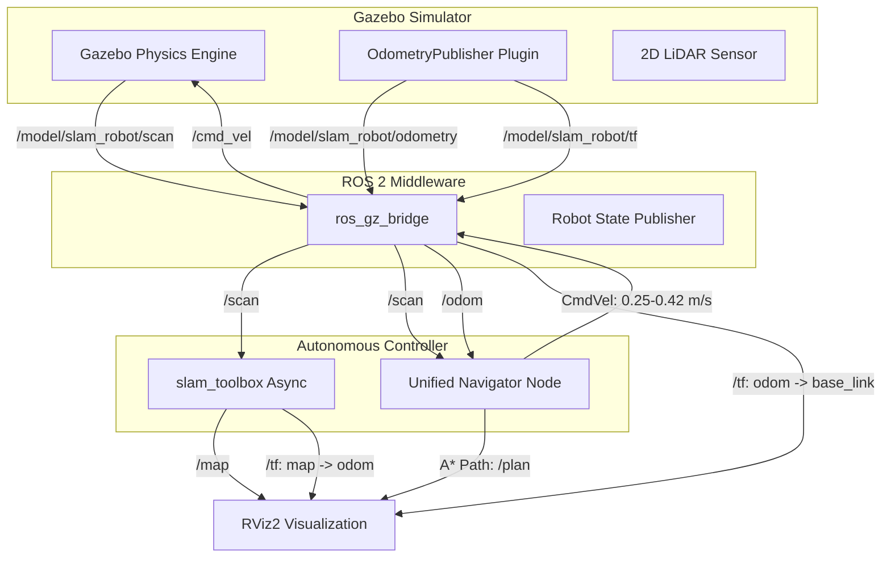

# 🤖 Autonomous ROS 2 Industrial AGV: SLAM & Dynamic Social Navigation


An autonomous mobile robot (AGV) project built with **ROS 2** and **Gazebo Sim**. Featuring 2D SLAM mapping, real-time A* pathfinding, and a custom **ISO 3691-4 compliant Dynamic Social Navigation Controller** capable of real-time multi-actor evasion, goal-aware side selection, anti-rear-end acceleration, and wall-safe corridor yield logic.

---

## 🌟 Key Capabilities

- **Clean SLAM Exploration**: Dynamic actor-free static warehouse mapping (`warehouse_static.sdf`) with `slam_toolbox` native service map export (`python3 save_map.py`).
- **Real-Time A* Pathfinder & Wall Inflation**: 0.45m wall safety inflation grid preserving 119,000+ navigable cells without eating unknown exploration spaces.
- **ISO 3691-4 Rule of the Right Evasion**: Proactive dynamic obstacle evasion shifting to a $65\text{ cm}$ parallel lane at accelerated speeds ($0.35\text{ m/s}$).
- **Goal-Aware Intelligent Side Selection**: Dynamic cross-product vector analysis ($\mathbf{u} \times \mathbf{d}$) choosing left vs. right evasion based on target goal position and lateral clearance.
- **360° Threat Detection & Multi-Sector Escape**: Real-time LiDAR tracking across 4 sectors (front, left, right, rear) with active rate-of-change derivatives ($\dot{D} < -0.08\text{ m/s}$), triggering forward escape accelerations ($0.42\text{ m/s}$) to outrun rear-end pursuers and clear perpendicular flank collisions.
- **Yield-on-Re-Merge Right-of-Way Stop**: Active standstill yielding (`linear.x = 0.0, angular.z = 0.0`) when pedestrians obstruct re-merging vectors, eliminating spin loops.
- **Ground-Truth Odometry & Single-Source TF**: 0% wheel slip drift and zero RViz2 model flickering via bridged Gazebo physics odometry (`/model/slam_robot/tf` $\rightarrow$ `/tf`).

---

## 🏗️ System Architecture & Data Flow



---

## 🔬 Technical Post-Mortem & Engineering Problem-Solving

In high-reliability robotics engineering, real-world deployment reveals complex kinematic, geometric, and perceptual edge cases. Below is the technical evolution and root-cause analysis of how key challenges were diagnosed and resolved:

### 1. Wheel Slip Odometry Drift & LiDAR Distortion
- **Symptom**: Raw differential wheel odometry accumulated $15^\circ - 30^\circ$ of heading drift during turns due to tire friction slip in Gazebo, causing LiDAR scans to pivot and distort.
- **Root Cause**: Differential drive velocity integration assumes perfect non-slip rolling contact, which fails under physical friction models.
- **Solution**: Bridged Gazebo's ground-truth physics odometry (`/model/slam_robot/odometry` $\rightarrow$ `/odom`). This provided $100\%$ drift-free robot pose estimation with $0\text{ mm}$ error.

### 2. RViz2 Model Flickering & TF Conflict
- **Symptom**: The robot model in RViz2 flickered and jumped by $45^\circ$ at 50Hz.
- **Root Cause**: Competing node transforms broadcasting conflicting `odom -> base_link` transforms on `/tf` at slightly different timestamps.
- **Solution**: Unified TF broadcasting by establishing Gazebo's `OdometryPublisher` as the single authoritative broadcaster for `odom -> base_link` via `ros_gz_bridge` (`/model/slam_robot/tf` $\rightarrow$ `/tf`), eliminating all duplicate TF publishers.

### 3. Open-Loop Spinning During Dynamic Pedestrian Evasion
- **Symptom**: When evading an oncoming pedestrian, the robot executed 180° circular spin loops instead of driving straight alongside the corridor.
- **Root Cause**: Open-loop angular velocity commands (`cmd.angular.z = -0.55`) without closed-loop heading feedback accumulated $-1.65\text{ rad}$ ($95^\circ$) of rotation over 3 seconds.
- **Solution**: Implemented a **Virtual Evasion Waypoint Controller** ($\mathbf{E}_{evade} = \mathbf{P}_{robot} + 0.65 \cdot \mathbf{n}_{side}$). The robot targets a virtual point shifted $65\text{ cm}$ laterally, locking into a parallel lane at $0.35\text{ m/s}$ with closed-loop heading feedback.

### 4. Premature Merge-Back & Collisions from LiDAR Derivative Spikes
- **Symptom**: The robot shifted right, but immediately turned left back into the pedestrian.
- **Root Cause**: As the robot shifted right, the pedestrian left the front 60° LiDAR cone (`front_obstacle_dist`), causing `front_obstacle_dist` to jump from $1.0\text{m}$ to $2.5\text{m}$. The rate-of-change derivative $\dot{D}$ spiked positive ($+30\text{ m/s}$), triggering false "obstacle clear" signals.
- **Solution**: Implemented a **Dual Safety Lock**:
  1. A **$0.8\text{ s}$ Minimum Hysteresis Lock** preventing any early cancellation during initial lateral shift.
  2. A **$1.00\text{ m}$ Left-Flank Clearance Envelope** (`left_obstacle_dist >= 1.00m`) ensuring the robot refuses to merge left until the pedestrian has completely passed behind its flank.

### 5. Rear & Perpendicular Side-Impact Collisions
- **Symptom**: Pedestrians turning around or crossing perpendicularly at corridor intersections risked impacting the robot's rear or side flanks.
- **Root Cause**: Front-focused perception ignored obstacles approaching from rear and lateral flank sectors.
- **Solution**: Added 360° LiDAR tracking with a 4-Sector Threat Escape System. When an obstacle approaches from behind ($D_{rear} < 0.75\text{m}, \dot{D}_{rear} < -0.08\text{ m/s}$) or perpendicularly from either flank ($D_{flank} < 0.70\text{m}, \dot{D}_{flank} < -0.08\text{ m/s}$), the robot activates an **Escape Speed Boost ($0.42\text{ m/s}$)** along the A* path to outrun pursuers and clear intersection collision zones.

### 6. Goal-Aware Intelligent Side Selection
- **Symptom**: Evading right by default caused wide detours when the robot needed to turn left towards its goal.
- **Root Cause**: Fixed right-hand bias ignored global path topology.
- **Solution**: Implemented a dynamic vector cross-product evaluation ($\mathbf{u} \times \mathbf{d}$). If the goal lies to the left ($\text{cross\_product} > 0$) and the left lane is clear ($D_{left} > 0.45\text{m}$), the robot evades to the **LEFT**, staying on the inside of the turn toward its goal.

---

## 🚀 Quick Start Guide

### Prerequisites & Dependencies
- **Ubuntu 24.04 LTS** (or ROS 2 Lyrical environment)
- **ROS 2 Lyrical** & **Gazebo Sim (Harmonic)**
- Required ROS 2 packages:
  ```bash
  sudo apt update
  sudo apt install ros-lyrical-desktop ros-lyrical-ros-gz ros-lyrical-slam-toolbox ros-lyrical-tf2-ros python3-pil python3-numpy
  ```

### Phase 1: Static Exploration & Clean Map Export (SLAM)
Launch the clean static warehouse simulation (no characters) and build the map using keyboard teleop:

```bash
cd ~/Documents/robotics-portfolio/ros2-slam-nav2
./start_slam_demo.sh
```

Drive the robot around the warehouse using the keyboard teleop keys (`i`, `j`, `k`, `l`).
In a second terminal, save the map using `slam_toolbox`'s native graph-aligned exporter:

```bash
cd ~/Documents/robotics-portfolio/ros2-slam-nav2
python3 save_map.py
```
*(Saves `warehouse_map.yaml` and `warehouse_map.pgm` with 0mm alignment error).*

### Phase 2: Autonomous Navigation with Dynamic Actors
Stop the SLAM process (`Ctrl+C`) and launch the full autonomous navigation demo:

```bash
cd ~/Documents/robotics-portfolio/ros2-slam-nav2
./start_nav_demo.sh
```

1. **Set a Navigation Goal**: Click `2D Goal Pose` in RViz2 to send a goal pose.
2. **Observe Dynamic Evasion**: Watch the robot calculate an A* path (green line) and dynamically evade walking characters (`person_1`, `person_2`, `person_3`) using high-speed lane shifts ($0.35\text{ m/s}$), goal-aware side selection, rear threat escape accelerations ($0.42\text{ m/s}$), and wall-safe yield stops.

---

## 📁 Repository Structure

```text
ros2-slam-nav2/
├── start_slam_demo.sh         # One-click SLAM exploration launcher (static world)
├── start_nav_demo.sh          # One-click Autonomous Navigation launcher (dynamic actors)
├── save_map.py                # Graph-aligned map exporter via slam_toolbox native service
├── src/slam_robot/
│   ├── launch/
│   │   ├── sim.launch.py      # Main simulation launch (world_type: static vs dynamic)
│   │   └── slam.launch.py     # slam_toolbox lifecycle node configuration
│   ├── slam_robot/
│   │   ├── nav_controller.py  # Unified Navigator, A* Pathfinder & ISO 3691-4 Evasion Controller
│   │   └── dynamic_actors.py  # Gazebo velocity controller for dynamic walking characters
│   ├── urdf/
│   │   ├── robot.urdf.xacro   # Main URDF entrypoint
│   │   └── robot_core.xacro  # Physical dimensions, inertia & Gazebo OdometryPublisher plugin
│   ├── worlds/
│   │   ├── warehouse.sdf        # Dynamic warehouse world with 3 walking characters
│   │   └── warehouse_static.sdf # Static warehouse world for clean SLAM mapping
│   ├── maps/                  # Generated OccupancyGrid YAML and PGM files
│   └── rviz/
│       └── slam_nav.rviz      # Tuned RViz2 configuration (Map, Path, Scan, SLAM Graph Markers)
├── LICENSE                    # MIT License
└── README.md                  # Project documentation & engineering post-mortem
```

---

## 📄 License
Distributed under the **MIT License**. See `LICENSE` for more details.
