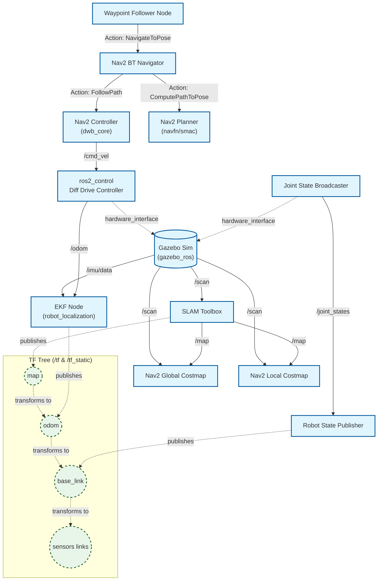

# System Architecture

This document describes the software architecture and node graph of the `slam_robot` ROS 2 system.

## High-Level Architecture

The system is composed of several key functional blocks:
1. **Simulation (Gazebo)**: Simulates physics, collisions, and generates sensor data.
2. **Robot Base (ros2_control)**: Interfaces with the simulated hardware to drive the wheels and read encoders.
3. **State Estimation (robot_localization)**: Fuses Odom and IMU for accurate localization.
4. **Perception & Mapping (SLAM Toolbox)**: Uses LiDAR data to map the environment and localize against it.
5. **Navigation (Nav2)**: Plans global and local paths, avoids obstacles, and sends velocity commands to the base.

## ROS 2 Node and Topic Graph

## Description of Key Components

- **EKF Node**: Subscribes to wheel odometry (from the `diff_drive_controller`) and IMU data (from Gazebo). It outputs a filtered odometry message and broadcasts the `odom -> base_link` transform.
- **SLAM Toolbox**: Subscribes to `/scan` (LiDAR) and uses the `odom -> base_link` transform to perform scan-matching. It builds an occupancy grid (`/map`) and broadcasts the drift-correction transform `map -> odom`.
- **Nav2 Stack**:
  - Uses the static `/map` for the Global Costmap.
  - Uses live `/scan` data to populate the Local Costmap with dynamic obstacles.
  - The `Planner Server` computes a high-level path from A to B.
  - The `Controller Server` generates velocity commands (`/cmd_vel`) to follow the path locally while avoiding sudden obstacles.
